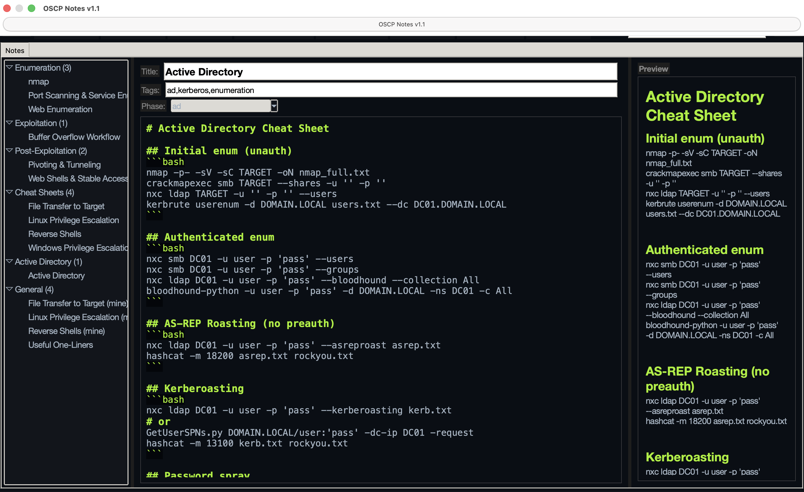

# OSCP Notes

> A cross-platform desktop notebook purpose-built for the OSCP exam — markdown notes with live preview, exam-day machine tracker, payload library, AES-encrypted vault, and one-click PDF / XLSX / HTML / JSON / CSV / TXT exports. 100% local, zero telemetry, zero cloud.

[](LICENSE)
[](https://www.python.org/)
[](#cross-platform-builds)
[](#install)

**v1.1** by **Mayur Parmar** ([th3cyb3rc0p](https://www.linkedin.com/in/th3cyb3rc0p/))

---


> Drop a real screenshot in `docs/screenshot.png` to replace this.

## Why this exists

During OSCP prep and on exam day, most people bounce between Obsidian / VSCode / CherryTree / Joplin / a wall of `nano`-edited `.txt` files. OSCP Notes puts everything in one window:

- write-up notes with phase tags (`enum` / `exploit` / `privesc` / `post` / `ad` / `cheatsheet` / `general`)
- per-machine tracker with timer, methodology checklist, creds table, loot, flag capture
- searchable payload library seeded with the commands you actually use
- AES-encrypted vault for loot, hashes, and PII you don't want on disk in plaintext
- one-click report shell generator that parses your note and writes a 10-section Markdown report skeleton

Built on Python + Tkinter so there's no Electron runtime, no auto-update channel, no telemetry — just a 60 MB `.app` you can audit and run offline.

## Features

- **Markdown editor** with live preview and Pygments syntax highlighting
- **Phase tags** + free-form tags + instant full-text search (SQLite FTS5)
- **11 built-in cheat sheets** — Reverse Shells, Linux/Windows PrivEsc, AD, BoF, Pivoting, Web Enum, File Transfer, Web Shells, One-Liners
- **Four themes** — OSCP Dark (default), Hack The Box, TryHackMe, Light
- **Auto-save** (debounced 1.2s) — never lose a note
- **Multi-format export** — PDF, XLSX, HTML, JSON, CSV, TXT, Markdown
- **Tracker tab** — per-machine timer, status, creds table, loot table, screenshots, methodology checklist with progress
- **Payloads tab** — searchable library of 35 starter payloads (msfvenom, reverse shells, webshells, AD recon, pivots, transfers)
- **Vault tab** — Fernet (AES-128-CBC + HMAC-SHA256) encryption with scrypt-derived keys; reveal-for-N-seconds button to limit accidental exposure
- **Report shell generator** — `Tools → Generate Report Shell from Note...`
- **Native menu bar**, **keyboard shortcuts**, **theme persistence**

## Install

Pick your OS:

### macOS (Homebrew — recommended)

```bash
brew tap th3cyb3rc0p/tap
brew install --cask oscp-notes
open /Applications/OSCP-Notes.app
```

To update later: `brew upgrade --cask oscp-notes`. To uninstall: `brew uninstall --zap oscp-notes` (the `--zap` also removes the macOS Library prefs).

### macOS (source)

```bash
brew install python-tk@3.14
python3 -m venv venv
./venv/bin/pip install -r requirements.txt
./venv/bin/python oscp_notes.py
```

### Linux (source)

```bash
sudo apt install python3-tk # Debian/Ubuntu/Kali/Parrot
# sudo dnf install python3-tkinter # Fedora/RHEL
# sudo pacman -S tk # Arch
python3 -m venv venv
./venv/bin/pip install -r requirements.txt
./venv/bin/python oscp_notes.py
```

### Windows (source)

Install [Python 3.11+ from python.org](https://www.python.org/downloads/windows/) with **"tcl/tk and IDLE"** checked, then:

```cmd
python -m venv venv
venv\Scripts\pip install -r requirements.txt
venv\Scripts\python oscp_notes.py
```

## Cross-platform builds

The same source tree builds a self-contained, double-clickable app on all three OSes. No Python required to run the resulting binary.

| OS | Script | Output | Size |
|----|--------|--------|------|
| macOS | `bash build_app.sh` | `dist/OSCP-Notes.app` (double-clickable) | ~60 MB |
| Linux | `bash build_linux.sh` | `dist/OSCP-Notes/` + `OSCP-Notes.desktop` launcher | ~70 MB |
| Windows | `build_windows.bat` (from `cmd.exe`) | `dist\OSCP-Notes\OSCP-Notes.exe` | ~60 MB |
| Windows (single-file) | `build_windows_onefile.bat` | `dist\OSCP-Notes.exe` (one .exe, slower launch) | ~30 MB |

Or run `bash build_all.sh` to pick the right script for your host. See [BUILDING.md](BUILDING.md) for details on what's bundled and how to cross-build via CI.

## Keyboard shortcuts

| Action | macOS | Windows / Linux |
|--------|-------|-----------------|
| New note | `Cmd+N` | `Ctrl+N` |
| Save now | `Cmd+S` | `Ctrl+S` |
| Duplicate note | `Cmd+D` | `Ctrl+D` |
| Focus search | `Cmd+F` | `Ctrl+F` |
| Toggle preview | `Cmd+E` | `Ctrl+E` |
| Delete selected note | `Delete` | `Delete` |
| Quit | `Cmd+Q` | `Ctrl+Q` |

## Data location

Notes, payloads, tracker progress, and vault entries live in a SQLite database created automatically on first launch:

- macOS: `~/OSCP-Notes/data/notes.db`
- Linux: `$XDG_DATA_HOME/OSCP-Notes/data/notes.db` (default `~/.local/share/OSCP-Notes/data/notes.db`)
- Windows: `%APPDATA%\OSCP-Notes\data\notes.db`

Use **File → Reveal Data Folder** in the app to open it. Back up by copying `notes.db`. Wipe by deleting it.

## Troubleshooting

**`ModuleNotFoundError: No module named 'tkinter'`**
- macOS: `brew install python-tk@3.14`, then use the matching Python (`python3.14` if your default `python3` isn't 3.14).
- Linux: install the Tk package for your distro (see the Linux install snippet above).
- Windows: re-run the Python installer and tick **"tcl/tk and IDLE"**.

**App opens but the preview pane is blank**
Make sure dependencies are installed into the active venv: `./venv/bin/pip install -r requirements.txt`.

**Want to add your own cheat sheets**
Use **File → New** and paste your notes, or edit `cheatseeds.py` and delete `data/notes.db` to re-seed on next launch.

## Project layout

```
oscp_notes.py # the app (~3200 lines, Tkinter + SQLite)
cheatseeds.py # first-run cheat sheet content
oscp_practice_list.py # LainKusanagi OSCP practice list (seed data)
OSCP-Notes.spec # canonical PyInstaller spec for all 3 OSes
build_app.sh # macOS build
build_linux.sh # Linux build
build_windows.bat # Windows build (folder)
build_windows_onefile.bat # Windows build (single .exe)
build_all.sh # host-OS dispatcher
requirements.txt # runtime deps (markdown, Pygments, reportlab, openpyxl, cryptography)
BUILDING.md # per-OS build details
CROSS_PLATFORM_PLAN.md # design notes for the cross-platform work
LICENSE # MIT
```

## Contributing

Bug reports, cheat sheet PRs, and theme PRs are welcome. If you want to add a new theme, edit the `THEMES` dict near the top of `oscp_notes.py` and pick a `PYGMENTS_STYLE` from [Pygments' built-in styles](https://pygments.org/styles/).

For a new cheat sheet: append it to `cheatseeds.py`. Delete your `data/notes.db` to re-seed on next launch.

## License

[MIT](LICENSE) — © 2026 Mayur Parmar (th3cyb3rc0p)

Good luck on the exam. 🏴‍☠️